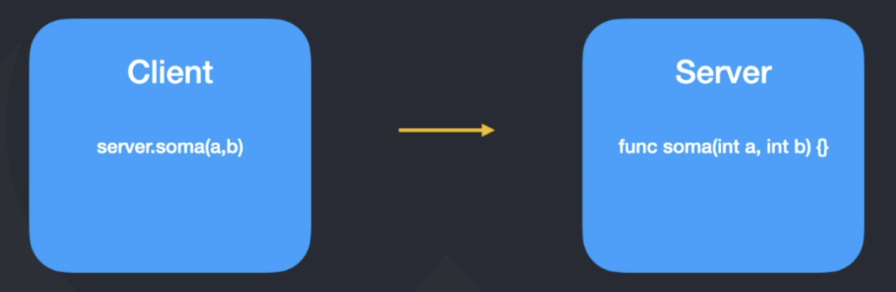

# gRPC

RPC is a modern open source high performance Remote Procedure Call (RPC) framework that can run in any environment. It can efficiently connect services in and across data centers with pluggable support for load balancing, tracing, health checking and authentication. It is also applicable in last mile of distributed computing to connect devices, mobile applications and browsers to backend services.

## Protocol Buffers

Protocol buffers are a language-neutral, platform-neutral extensible mechanism for serializing structured data. You define how you want your data to be structured once, then you can use special generated source code to easily write and read your structured data to and from a variety of data streams and using a variety of languages. Think XML, but smaller, faster, and simpler 😅

### Protocol Buffers vs JSON

- Protocol Buffers are smaller than JSON
- Protocol Buffers are faster than JSON
- Protocol Buffers require less CPU and bandwidth than JSON

## HTTP/2

- The original name of HTTP/2 was SPDY (pronounced "SPeeDY"), invented by Google
- It was released in 2015
- It sends multiple requests between client and server in a single TCP connection
- It is binary, instead of textual
- It is fully multiplexed, instead of ordered and blocking
- It allows servers to "push" responses proactively into client caches instead of waiting for a new request for each resource
- Header compression is a default part of the protocol